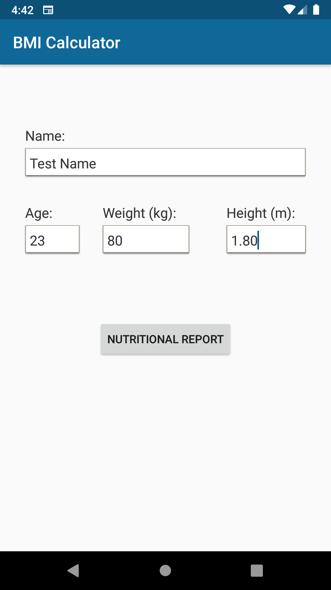
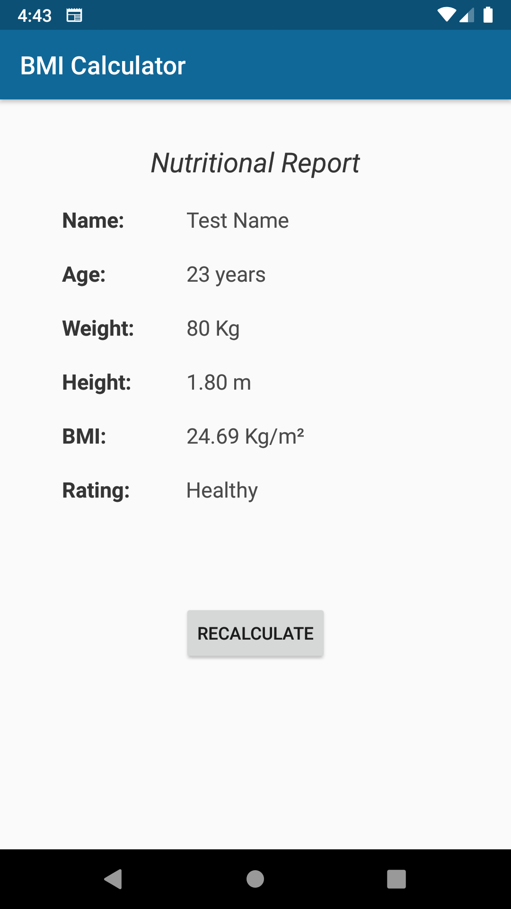

# Android-IMC-Calculator 
### Idioma do README ([en](README.md)/pt)

Segundo projeto prático da disciplina INF-311 (Programação para Dispositivos Móveis), na Universidade Federal de Viçosa (UFV).

O programa possui uma tela para o input de dados do usuário e outra tela para apresentar o resultado do Índice de Massa Corporal (IMC).

### Screenshots
<table>
  <tr>
    <td></td>
    <td></td>
  </tr>
</table>
