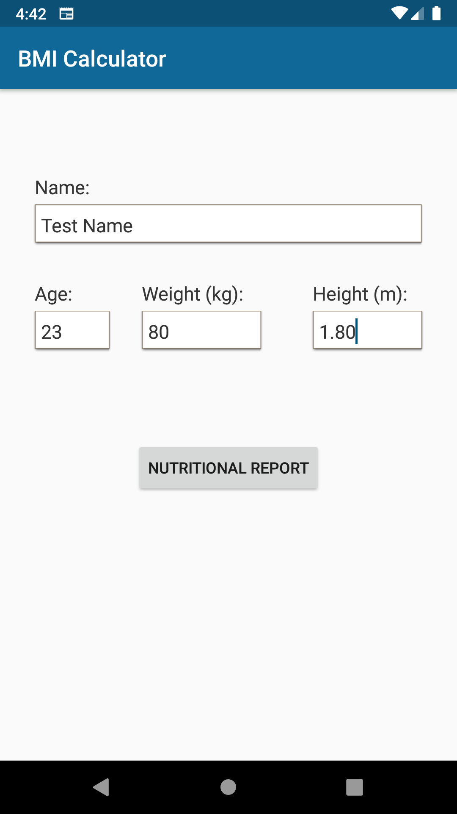
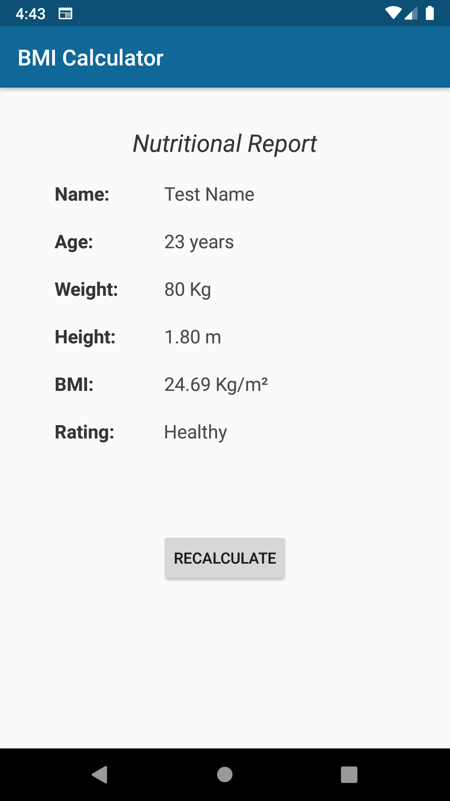

# Android-BMI-Calculator
### README language (en/[pt](README-pt.md))

Second practical project of the discipline INF-311 (Programming for Mobile Devices), at the Federal University of Viçosa (UFV).

The program has a screen for user data input and another screen to present the result of the Body Mass Index (BMI).

### Screenshots
<table>
  <tr>
    <td></td>
    <td></td>
  </tr>
 </table>
